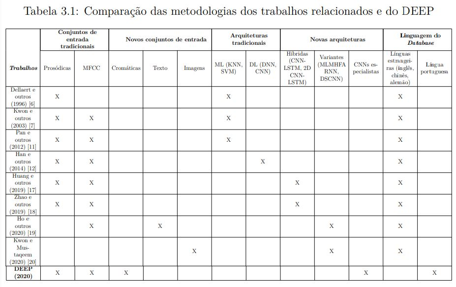
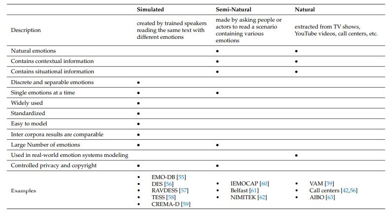
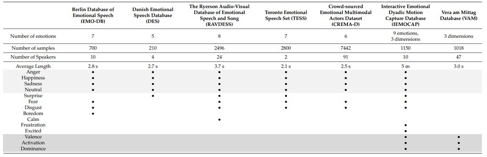
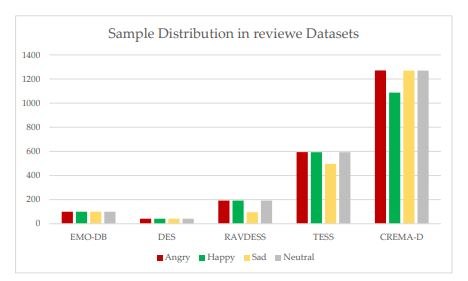
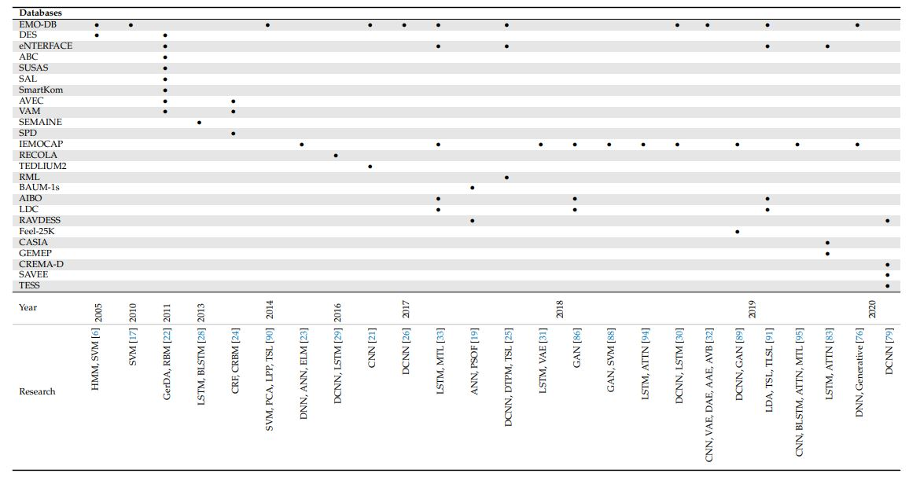
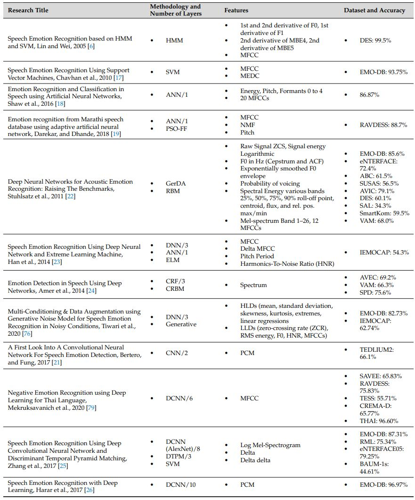
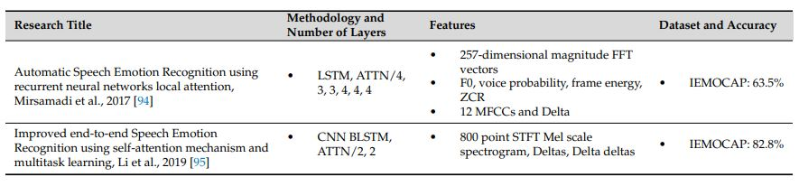
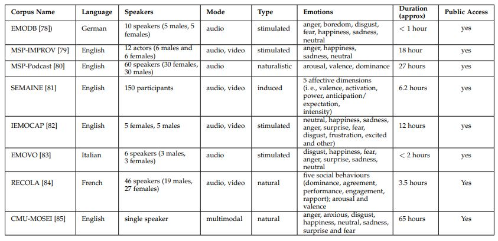
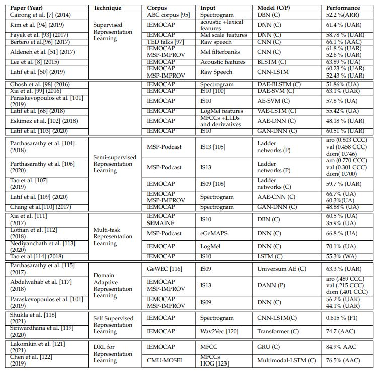

# Fichamento @ dissertação

## 1. [Speech Emotion Recognition using Supervised Deep Recurrent System for Mental Health Monitoring](https://arxiv.org/abs/2208.12812) ++

"Mental health is one of the crucial health aspects that must be monitored and treated for better physical health and a safer community and social life [1]."

"According to the World Health Organization (WHO), during the first year of the COVID-19 pandemic, depression and anxiety disorders have increased by 25% globally, especially among young people and women. Due to late or unreceived mental care, the number of related suicide has increased as well. The number of suicides has exceeded 700,000, meaning one person every 40 seconds dies by suicidal action related to a mental disorder [3]."

"Speech is the primary form of communication and emotional expression [5]. From childhood, even before being able to speak correct words, children express their emotions in their ununderstandable talks, such as their happiness and confusion. Juvenile, adults, and elderly individuals also express their emotions in their speech. All individuals express common emotions such as happy, sad, angry, happy, worry, fear, and neutral in their speech. However, different spoken languages produce differences in how these emotions are expressed in the speech tone and voice [6], [7]."

"There are several mental disorders that can be identified from individual’s emotion changes [9], [10] such as depression disorder [11], [12], stress disorder [13], [14], and anxiety (worry/fear) disorders [15], [16]. Early diagnostic of mental disorders allows the individual to recieve the correct treatment and prevent sever illensses and even protect fom suicidal action [17], [18]."

"Intelligent Virtual Personal Assistants (IVA) [19], [20] is a software agent that can perform services for an individual based on processing users’ questions or commands via text or voice, depending on the IVA design and purpose. Several studies address the effect of the IVA devices on individuals’ social life [24], marketing [25], and social communication [26]. However, there are few studies on  the user behavior while using intelligent virtual personal assistant devices to improve the user experience. Yang et al. [27] attempted to understand how to improve the IVA user experience by investigating the relationship between perceived enjoyment, perceived usefulness, and productrelated characteristics using a user survey. Coskun et al. also used questionnaire data to address the factors affecting IVA user experience [28]"

"Speech emotion recognition is one of the complex problems to solve as the emotional expression is tightly reliant on the spoken language, dialect, accent, and individuals’ cultural background. In addition, the audio signal itself preserves the spatial and temporal features of the speech. There have been several attempts to solve the speech emotion recognition problem. The main two scenario approaches:

    - Scenario I: designing a model that used speech signal datasets after performing data preprocessing and feature extraction;

    - Scenario II: designing a model that converts the speech signal to images (spectrograms) and then performing data preprocessing and feature extraction to fit the data to image-based models.

Wani et al. [30] and Lotfidereshgi et al. [31] are examples of using the scenario II methodology to address the speech emotion recognition. The significant drawbacks of scenario II are that the data is processed without any consideration of temporal features in the speech signal, which significantly limits the ability of such models to recognize different emotions from the speech correctly. In addition, the data transformation and feature extraction require additional implementation costs from both hardware and software aspects. For the scenario I, Zhang et al. [32], Bhargava et al. [33], Krishnan et al. [34], and Venkataramanan et al. [29] proposed different machine learning and deep learning approaches to solve the speech emotion recognition under the scenario I approach. This approach requires less data transformation and feature extractions compared to the scenario II approaches.  However, these models were not considering the temporal information within the audio signal within their approaches"

"This paper proposed a simple design hybrid model of the gated recurrent neural networks (GRU) with a 1D convolution neural network (1D-CNN) support."

"Toronto emotional speech set (TESS) [49]"

"The model can be applied within an intelligent virtual personal assistant to improve the user experience while combining the user request and emotion to provide the appropriate service"

"Personal emotion is one of the most significant indicators of mental health normality and issues."

"The significance of the proposed model is that it does not require any additional data preprocessing due to the 1DCNN that behaves to extract the features from the speech signal."

### 1.1

""

""

""

### 1.3

### 1.5

### 1.6

### 1.7

___
## 2. [Depression Recognition using Remote Photoplethysmography from Facial Videos](https://arxiv.org/abs/2206.04399)

> n/a

___
## 3. [Accurate Emotion Strength Assessment for Seen and Unseen Speech Based on Data-Driven Deep Learning](https://arxiv.org/abs/2206.07229) -> [ISCA](https://www.isca-speech.org/archive/pdfs/interspeech_2022/liu22i_interspeech.pdf) ++

"Accurate emotion classification of speech and assessment of its strength are essential to profile human behaviors, which has many potential applications, such as human-robot interface,
human-machine dialogue, and social media. In recent years, there is an increasing interest in emotion control in expressive speech synthesis, such as emotional text-to-speech, emotional voice conversion, where accurate control of emotional strength in speech becomes critically important."

"The simplest emotion strength control method is to linearly scale the emotion representation vector [1]. The effect of such a linear scale is hardly interpretable. To obtain a meaningful
strength descriptor, some followed the idea of “relative attributes” [2–4] and quantify the emotion strength by learning from the <neutral, emotional> speech pairs. Support-VectorMachine (SVM) based attribute ranking [4] learns the difference between two samples that are significantly different in a particular attribute, that has been widely studied in computer vision [5, 6]."

"In speech processing, Zhu et al. [2] proposed to learn an emotion attribute ranking function R(·) from the <neutral, emotional> paired speech features. or of the emotion strength of one specific emotional speech. Lei et al. [3] further extended the utterance level emotion attribute ranking function to phoneme level and obtain a fine-grained ranking function. We note that a trained ranking function R(·) on specific data is not easily generalized to new domains. In other words, R(·) is not able to calculate an accurate or appropriate strength score for unseen or out-of-domain speech. To extend to a new data, we need to retrain a new ranking function on the <neutral, emotional> paired samples from the new data. Furthermore, the learning of ranking functions for new data requires parallel samples. All these limit the scope of applications. Recently, it was shown that deep learning has the ability to learn a mapping function effectively [7,8]. The neural solution learns complex non-linear mapping relationships, and exhibits good generalization ability with the support of a large number of model parameters [9]. Most importantly, the datadriven training strategy appears to be more powerful and have the potential to achieve good performance for out-of-domain data [10]."

"StrengthNet is a multi-task framework that includes a convolutional neural network (CNN) based acoustic encoder, a bidirectional long short-term memory (BiLSTM) based strength predictor and an auxiliary BiLSTM based emotion predictor.
    1) We propose a novel data-driven deep learning based speech emotion strength assessment model, i.e., StrengthNet;
    2) We show that the predicted emotion strength of seen and unseen speech is highly correlated with the ground truth; To our best knowledge, this is the first deep learning model for accurate emotion strength assessment for seen and unseen speech."

"The strategy of stacking more convolutional layers to expand the receptive field of a CNN
has been widely used to model time series data and yield satisfactory performance [7]. The strength predictor then reads the high-level feature representation to predict the emotion strength. Recent studies have confirmed the effectiveness of combining CNN and BiLSTM for classification [7], and recognition [11] tasks"

"As shown in Fig. 2, to improve the model generalization, we employ a domain fusion strategy [12, 13], which mix multiple emotional speech datasets from various domains to train our
StrengthNet."

"We use the ESD dataset [15] to validate the performance of StrengthNet in terms of strength prediction. The English corpus with a total of nearly 13 hours of speech is used in our
experiments. In addition, we use two additional English SER datasets: the Ryerson Audio-Visual Database of Emotional Speech and Song (RAVDESS) [16] and the Surrey AudioVisual Expressed Emotion (SAVEE) database [17]. The emotional speech databases can be divided into two types: acted and improvised [18]. All above three mentioned datasets belongs to acted family which widely used in emotional TTS [19]. We believe that it is appropriate
to employ acted emotional speech dataset for our experiments, due to the improvised speech is hard to induce strong and welldifferentiated emotions [20]."

"We further verify the effectiveness of the proposed domain fusion for model generalization in terms of emotion strength prediction."

"We further evaluate how close the results of StrengthNet for unseen speech can get to the emotional strength as perceived by humans. Since the RAVDESS dataset includes the manual emotion intensity label.  The experiments confirm the superiority of the proposed domain fusion based StrengthNet for unseen speech in terms of human perception."

"In future work, we intend to integrate our StrengthNet as a front-end or back-end for emotional speech synthesis models to enhance the emotion expressiveness
of output emotional speech."

___
## 4. [Emotional Speaker Identification using a Novel Capsule Nets Model](https://arxiv.org/abs/2201.02994) -> [Expert Systems with Applications](https://www.sciencedirect.com/science/article/abs/pii/S0957417421017498)

"Speaker recognition has received increasing attention recently with increasing demands in various applications, e.g., security systems, biometric authentication, criminal investigation, and customer care (Alsharhan & Ramsay, 2019; B. Chen & Chen, 2013; Jahangir et al., 2021). Although we do not give significant consideration to the human capability of discriminating speakers using their voices alone, it has been proven to be an integral part of human–computer interactions and has been studied consistently (Shahin et al., 2021, 2022)"

"Several studies have proposed speaker identification techniques that have made significant contributions in the field (Farrell et al., 1994; Praveen Kumar et al., 2018); however, various conditions, e.g., noisy environments or the speaker’s emotional, can affect the performance of such techniques (Bashirpour & Geravanchizadeh, 2018). The performance of these approaches is reduced significantly when the speech samples are obtained under suboptimal
conditions, e.g., an emotional environment (J. H. L. Hansen & Patil, 2007), where the speech samples are emotional or highly expressive (Ghiurcau et al., 2011; Parthasarathy et al., 2017)."

"Speech samples obtained under circumstances where the speaker is not influenced by any kind of emotion is referred to as ‘neutral’ speech samples, while those under any kind of emotion (such as happy, sad, anger and so on) are referred to as emotional speech."

"Human speech is more frequently emotional or expressive, which alters the speech characteristics of a speaker. These deviations in speech characteristics from neutral speech adversely affect model performance in the presence of such emotions (D. Li et al., 2005; Nassif et al., 2021)."

"Nonetheless, recognizing the emotional aspect with linguistic statements is essential to establish a proper communication link in human–computer interfaces (Picard, 1999). However, this is a difficult problem when humans can also fail to accurately recognize emotion in a speech sample. Thus, speaker identification under stressful or emotional conditions is a challenging area of research."

"CNN uses a pooling operation, which makes them insensitive to the spatial information of the input features, i.e., the position information of features in the time-frequency axis. . The pooling function makes the CNN invariant and results in losing certain features."

"The Emirati Speech Database (Shahin et al., 2018, 2019), RAVDESS (Livingstone & Russo, 2018), The SUSAS (J. H. Hansen et al., 1997)" 

"The CapsNet model proposed by Sabour et al. (Sabour et al., 2017) comprises two parts. The first part includes two convolutional layers with the final layer restructured to form the primary capsule layer followed by the digit capsule layer with capsules of 16 dimensions. The second part comprises a decoder network made of three fullyconnected (FC) layers"

___
## 5. [MEL Spectrogram](https://medium.com/analytics-vidhya/understanding-the-mel-spectrogram-fca2afa2ce53)

"A signal is a variation in a certain quantity over time. For audio, the quantity that varies is air pressure. How do we capture this information digitally? We can take samples of the air pressure over time. The rate at which we sample the data can vary, but is most commonly 44.1kHz, or 44,100 samples per second. What we have captured is a waveform for the signal, and this can be interpreted, modified, and analyzed with computer software."

"An audio signal is comprised of several single-frequency sound waves. When taking samples of the signal over time, we only capture the resulting amplitudes. The Fourier transform is a mathematical formula that allows us to decompose a signal into it’s individual frequencies and the frequency’s amplitude. In other words, it converts the signal from the time domain into the frequency domain. The result is called a spectrum."

"The fast Fourier transform (FFT) is an algorithm that can efficiently compute the Fourier transform. It is widely used in signal processing. I will use this algorithm on a windowed segment of our example audio."

"Short-time Fourier transform. The FFT is computed on overlapping windowed segments of the signal, and we get what is called the spectrogram."

"You can think of a spectrogram as a bunch of FFTs stacked on top of each other. It is a way to visually represent a signal’s loudness, or amplitude, as it varies over time at different frequencies. There are some additional details going on behind the scenes when computing the spectrogram. The y-axis is converted to a log scale, and the color dimension is converted to decibels (you can think of this as the log scale of the amplitude). This is because humans can only perceive a very small and concentrated range of frequencies and amplitudes."

"Studies have shown that humans do not perceive frequencies on a linear scale. We are better at detecting differences in lower frequencies than higher frequencies. For example, we can easily tell the difference between 500 and 1000 Hz, but we will hardly be able to tell a difference between 10,000 and 10,500 Hz, even though the distance between the two pairs are the same. In 1937, Stevens, Volkmann, and Newmann proposed a unit of pitch such that equal distances in pitch sounded equally distant to the listener. This is called the mel scale. We perform a mathematical operation on frequencies to convert them to the mel scale."

"A mel spectrogram is a spectrogram where the frequencies are converted to the mel scale. I know, right? Who would’ve thought? What’s amazing is that after going through all those mental gymnastics to try to understand the mel spectrogram, it can be implemented in only a couple lines of code."

"1. We took samples of air pressure over time to digitally represent an audio signal; 2. We mapped the audio signal from the time domain to the frequency domain using the fast Fourier transform, and we performed this on overlapping windowed segments of the audio signal; 3. We converted the y-axis (frequency) to a log scale and the color dimension (amplitude) to decibels to form the spectrogram; 4.We mapped the y-axis (frequency) onto the mel scale to form the mel spectrogram."

___
## 6. [Automatic Detection of Depression from Stratified Samples of Audio Data](https://arxiv.org/abs/2111.10783)

"Depression is defined by the American Psychiatric Association as a common mental disorder that causes sadness and loss of interest in activities which were once enjoyed by the individual [4][62]."

"Currently, there has been an integration of Artificial Intelligence (AI) in various fields of medical analysis [26][27][28][29][30], but not many were practically used in psychological disorders detection. Skills developed by psychiatrists for instance speech pattern analysis can be 3 learned and mastered by AI. Therefore, AI has become a promising alternative to manual depression detection."

"Speech is an act of expressing ideas and emotion by vocalization [31]. It is also an indispensable component for communication between individuals inside human society. As for communication, another element called “language” has been used along with speech. Language is the way to express thought through a distinct set of symbols, dialects, or sounds (speech). Language understanding can be acquired by a comprehensive study of vocal patterns and alphabets. Humans are capable of identifying as well as expressing speech and languages; meanwhile, machines do not have the ability to do so."

"For automatic speech recognition (ASR), the system will process vocal data (speech) into digital signals suitable for AI training and analysis [32]. Speakers have unique voice patterns due to the variation of personalities and body structure. Accordingly, ASR uses criteria such as speech size and speaking styles to classify voice samples into groups. Spectrograms and chroma feature techniques may potentially enhance the system in organizing voices [33]. Both techniques extract and present relevant features to the system, enabling the system to conduct more complex classification and evaluation [34][38][42][52]. The methods provided above allow AI to effectively perform speech and emotions recognition"

"In many speech recognition projects, the analysis focuses on the distribution of acoustic patterns over time [43][48][51][58]"

"DAIC-WOZ is part of a larger dataset - DAIC (Distress Analysis Interview Corpus)"

"Techniques for feature extraction such as Mel-Spectrograms have been used extensively in the field of speech recognition systems [44][45][46][47]. Mel spectrogram is a non-linear transformation of frequency based on the waveform of the audio samples [48]. Mel-spectrograms are calculated based on logarithmic frequency spacing and frequency amplitude. On the spectrogram, magnitude will indicate the amplitude of the extracted frequencies [49][50]. However, when portrayed on a Mel-Spectrogram, the values representing amplitudes of each frequency domain (features) at a given time interval are often too subtle to distinguish. "

___
## 7. [Automated Sex Classification of Children's Voices and Changes in Differentiating Factors with Age](https://arxiv.org/abs/2209.13112)

> n/a

___
## 8. [Language Independent Emotion Quantification using Non linear Modelling of Speech](https://arxiv.org/abs/2102.06003)

"Emotion is a psychological state related with the sensory system brought on by hormonal changes differently connected with contemplations, sentiments, social reactions, and a level of joy or disappointment. This hormonal changes cause audibly distinguishable features in speech and visibly distinct features in facial expressions. This audio-visual communication helps people to perceive each other’s emotion. Audio signal, including both speech and music, in general are inherently complex and few non-linear studies have been conducted to understand the underlying complexity and nonlinearity of these signals and their manifestation in the human brain [1-12]. This underlying complex nature of audio signals makes emotion recognition a troublesome task for a machine. The motivation behind emotion recognition framework is to utilize feeling related learning so that human machine
correspondence will be improved [13]"

___
## 9. [Voice Conversion Based on Cross-Domain Features Using Variational Auto Encoders](https://arxiv.org/abs/1808.09634)

> n/a

___
## 10. [A Fine-tuned Wav2vec 2.0/HuBERT Benchmark For Speech Emotion Recognition, Speaker Verification and Spoken Language Understanding](https://arxiv.org/abs/2111.02735)

"In speech domain, excellent self-supervised models are emerging [1, 2, 3, 4, 5, 6, 7, 8, 9]"

"The three most widely used and most representative datasets were chosen in our experiments, which are IEMOCAP for SER, VoxCeleb1 for SV and SLURP for SLU"

___
## 11. [Improving Automatic Emotion Recognition from speech using Rhythm and Temporal feature](https://arxiv.org/abs/1303.1761)

"Automatic emotion recognition from speech signal has become a major research topic in the field of  Human computer Interaction (HCI) in the recent times due to its many potential applications. It is being applied to growingnumber of areas such as humanoid robots, car industry, call centers, mobile communication, computer tutorial applications etc. [1]."

"The most commonly used acoustic features in literature are related to MFCC’s and prosody features like pitch,
intensity and speaking rate .In addition to these features we exploit a set of loudness features which are extracted byusing bark filter bank as described by Zwicker[2]."

___
## 12. [DEEP: Uma arquitetura para reconhecer emoção com base no espectro sonoro da voz de falantes da língua portuguesa](https://bdm.unb.br/bitstream/10483/27583/1/2020_GabrielCampos_LucasMoutinho_tcc.pdf)

"O reconhecimento de emoção em fala é uma linha de pesquisa dentro da Inteligência Artificial (IA), que consiste nas tarefas de reconhecimento e classificação da reação afetiva de um indivíduo [1]."

"O estudo das emoções e a maneira pelas quais as entendemos e as representamos no contexto computacional formam a área de conhecimento denominada Computação Afetiva [2]."

" Historicamente, o campo de estudo de IA foi construído com base em conceitos de como a aprendizagem humana funciona [3]."

"A aplicação de modelos estatísticos e de algoritmos de aprendizagem de máquina, do inglês machine learning (ML), vem sendo um dos possíveis caminhos para realizar tarefas de reconhecimento de emoção na fala desde o final do século XX [6] [7]"

"Dentre essas pesquisas, cabe citar o trabalho de Scherer (1995) [8], que apresenta evidências de que emoções são expressas diferentemente pela fala humana e que ouvintes são capazes de corretamente inferir o estado emocional de um interlocutor apenas com a informação da voz"

"Existem trabalhos [13] que apontam que a linguagem falada é um dos aspectos que influenciam diretamente no processo de reconhecimento de emoção."

"O aumento da capacidade de processamento dos computadores e o avanço das tecnologias de cloud computing mitigaram o custo computacional de técnicas mais complexas de ML, como as de Deep Learning (DL) [14], esta que engloba técnicas de aprendizagem de máquina que exploram uma grande quantidade de dados ao identificar padrões de maneira profunda [15]. Esse fator favorece a utilização de técnicas de Deep Leaning em problemas cujas características relevantes não são facilmente reconhecíveis, como visão computacional, processamento de linguagem natural e reconhecimento automático de emoção na fala."

"A literatura relacionada apresenta diversas propostas de modelos para a realização da tarefa de reconhecimento de emoção na fala. Trabalhos como Dellaert et al. (1996) [6], Kwon et al. (2003) [7] e Pan, Shen (2012) [11], utilizam modelos mais tradicionais de IA, tais como K-nearest Neighbors (KNN), Support Vector Machines (SVM) e Hidden Markov Models (HMM). Em Dellaert et al. (1996) [6], são utilizadas apenas features prosódicas para o modelo, com o intuito de reconhecer emoções somente pelas características fonéticas e linguísticas do som. Já em Kwon et al. (2003) [7] e Pan, Shen (2012) [11], são incorporadas as features MFCC aos modelos, que, a partir deste momento, tornou-se a feature predominante em trabalhos da área. Contudo, Dellaert et al. (1996) [6], Kwon et al. (2003) [7] e Pan, Shen (2012) [11] utilizam, ainda, modelos de ML mais simplórios, como o HMM, o KNN e o SVM."

"base de dados de emoção na voz em língua portuguesa VERBO [21]"

"Uma das formas de se organizar o conjunto de emoções é observada no Modelo Circumplexo, introduzido por Russel em [22]"

"Aprendizagem de Máquina (ML) é uma subárea de estudos de IA, definida [23] como o campo de estudos de agentes inteligentes. Os agentes inteligentes são módulos que recebem alguma informação do ambiente e tomam ações baseadas nas informações recebidas."

"A aplicação de ML tem como objetivo construir algoritmos que otimizem uma métrica de performance definida, pelo uso de dados de exemplos ou experiências prévias [24]. No seu núcleo, técnicas de ML utilizam métodos estatísticos e modelos matemáticos para construir inferências ou generalizações baseadas nos exemplos de treinamento."

"O termo Rede Neural deriva historicamente das tentativas de modelar e representar o processo de aquisição de conhecimento por computador, baseando-se no processo biológico de aprendizagem [25]."

"A aplicação de modelos estatísticos e de algoritmos de aprendizagem de máquina para o reconhecimento da fala vem sendo discutida em trabalhos acadêmicos desde o final do século XX [27] [28]. A utilização destes para o reconhecimento de emoção na fala também tem trabalhos datados do mesmo período [6] [7], porém ganharam mais espaço apenas nos últimos anos, em especial de 2012 a 2020 [11] [12] [17] [18] [19] [20]."

"Dada a necessidade de exploração de modelos mais robustos, na bibliografia mais recente, alguns trabalhos optam por estudar o impacto de algoritmos de DL no reconhecimento de emoção na voz [12] [16]. Na pesquisa de Han, Yu e Tashev (2014) [12], objetiva a procura de modelos mais apropriados para a tarefa de reconhecimento de emoção na fala, que possam superar os considerados estado-da-arte da época, entre estes os SVM. Nesta busca, foram obtidos resultados que sugerem que a utilização de redes neurais, como as DNNs (Deep Neural Networks), alcança acurácias 20% melhores em comparação aos demais modelos de aprendizagem de máquina, como as SVM e as HMM."

"Percebe-se em ambas pesquisas [17] [18] que a aplicação de arquiteturas mais robustas, como as híbridas, pode acarretar em ganhos de performance quando comparados a um único modelo de DL."

"Tal objetivo só é possível devido à recente publicação do trabalho de Neto, José e Filho (2018) [21] que contempla a construção de uma base de dados de emoção na voz em língua portuguesa, o VERBO."

"MFCC: Além de ser uma das formas de representação espectral do som, é uma das features mais aplicada para tarefas de reconhecimento de fala [30] [31] e de emoção na fala [11] [7]. Os MFCCs são compostos por um conjunto de coeficientes, que coletivamente formam um MFC, Mel-Frequency Cepstrum, que é uma representação da densidade espectral a curto prazo de um som. Para obter estes coeficientes, é realizado o processo chamado de Mel-Frequency Wrapping. Sua ideia é de transformar a saída da FFT em uma instância de uma escala Mel [32],"

"Prosódicas: A feature prosódica relaciona-se às características fonéticas e linguísticas do som, as quais se associam com elementos interligados da fala, ao contrário de segmentos fonéticos individuais. Tal feature utilizada em sistemas de reconhecimento de voz [6] [11] para informar sobre aspectos tais como entonação, tremulação, estresse e ritmo. Com essa feature é possível compreender a sonoridade, a tremulação e a afinação do discurso humano, padrões presentes no espectro sonoro que auxiliaram no treinamento do modelo."

___
## 13. [A Knowledge-Based Recommendation System That Includes Sentiment Analysis and Deep Learning](https://sci-hub.se/10.1109/tii.2018.2867174) -> [IEEE Transactions on Industrial Informatics](https://ieeexplore.ieee.org/document/8445585)

"Most of the studies about health systems [11]–[13] use sensor devices to detect mental disorders"

"The sentiment analysis helps industries to formulate marketing strategies, support after-sale services [29], develop health monitoring system, RS [3]"

___
## 14. [Emotion intensity detection for social media data](https://sci-hub.se/10.1109/iccmc.2017.8282664) -> [International Conference on Computing Methodologies and Communication (ICCMC)](https://ieeexplore.ieee.org/abstract/document/8282664)

"Emotion impacts our daily lives and is also important in all aspects of our daily living. It influences our social relations, memories and even day-to-day decision making"

"Emotion is a strong feeling which derives from one’s method of forming judgment about circumstances, event or relationships with others .Emotions are complex. The study of emotion in psychology started in the 1970s and till date many different theories have being proposed, studied and scrutinized"

"Emotion classification is a task wherein the aim is to detect and recognize types of feelings through the
expression of texts, such as anger, disgust, fear, happiness, sadness, and surprise. Emotion detection may have different applications such as finding out how happy the citizens are, providing better services to an individual and suggestions in helping an individual who is in anxiety which can be identified through the outgoing texts and emails. Many authors have done noteworthy work in this field."

"Emotion intensity becomes crucial when we want to compare sentences having the same emotion category. In this case, we can use the intensity of each word to compute the overall intensity of the sentence. Words having the same meaning can be used either to enhance or diminish the emotion intensity of a sentence. So far the field of detecting emotion intensity remains less explored but sentiment intensity is been considered for research[9-11] which will further pave way for detection of emotion intensity."

___
## 15. [Emotion Detection and Analysis on Social Media](https://arxiv.org/abs/1901.08458)

"Emotions are described as intense feelings that are directed at something or someone in response to internal or external events having a particular significance for the individual."

___
## 16. [The paradoxical role of emotional intensity in the perception of vocal affect](https://www.nature.com/articles/s41598-021-88431-0) -> [Nature](https://www.nature.com/articles/s41598-021-88431-0) += [VIVAE](https://zenodo.org/record/4066235#.Y2FyG99v-Ul)

"Whether conveyed by the face, body, or voice, expressions of emotion are ubiquitous. Te inferred meaning of the
expressions is, generally speaking, substantially aligned with the afective content expressed, and it is  intuitive to suggest that the stronger the expressed afective state the more clear-cut the inferred emotional meaning. Indeed, a body of research suggests that high-intensity emotion expressions are better ‘recognized’ [1,2,3,4,5]."

"The discovery of perceptual ambiguity for facial [10,11] and vocal [12] expressions of peak emotional intensity. In the latter study, vocalizations of extreme positive valence could not be disambiguated from extreme negative valence. Moreover, these authors demonstrated a trend opposite the predicted relation for peak intense positive situations: the reactions of real-life lottery winners were rated more negatively as hedonic intensity (in this case cued by the prize sum) increased. Tey argue that peak emotion expression is inherently ambiguous and reliant on contextual information [12–14]"

"It is unclear whether ambiguity is specifc to peak emotion, or if afective expressions are generally
more ambiguous than previously thought [12,13]."

"Tough valence and arousal are equally fundamental in emotion theoretical frameworks, it is implausible to assume that the human voice does not signal physical activation or arousal in the most extreme instances of
emotion. In fact, from an ethological perspective, a perceptual representation of arousal as well as the specifc intensity of the emotional state seem essential, even when overall valence and the specifc type of emotion cannot be identifed."

"Tree experiments show that listeners are remarkably good at inferring meaning from variably intense nonverbal vocalizations. Yet their ability to do so is afected by the expressed emotional intensity. We demonstrate a complex relationship between intensity and inferred afective state. Whereas both intensity and arousal are perceived coherently over the range of expressed intensities, the facilitatory efect of increasing intensity on classifying valence and emotion category plateaus at strong emotions. Remarkably, peak emotions are the most ambiguous of all. We call this the ‘emotion intensity paradox’. Our results suggest that value (i.e., valence and emotion category) cannot be retrieved easily from peak emotion expressions. However, arousal and emotion intensity are clearly perceivable in peak expressions."

"In line with previous research [3,4], the data underscore that emotion intensity constitutes a prominent property of vocal emotion communication."

"Low intensity expressions were frequently confused, and the least accurately classifed were peak intensity expressions. Te higher ambiguity of peak states was refected in both lower valence and lower emotion classifcation accuracy. At the most extreme instances of emotion, the evaluation of ‘afective semantics’, i.e., valence and emotion type, is constrained by an ambiguous perceptual representation. We fnd that peak emotion is not per se ambiguous. Arousal and intensity of emotion expressions are perceived clearly across the range of expressed intensities, including peak emotion (e.g. Fig. 4). Notably, we fnd that the intensity of the expressions is accurately perceived even if other afective features, such as valence and emotion category, prove ambiguous. In other words, for a given expression, despite the unreliable identifcation of the afective semantics, the relevance of the signal is readily perceived, through the unambiguous representation of arousal and intensity."

"Taken together, extremely intense expressions seem to convey less information on the polarity (positive or negative, triumph or anger)"

___
## 17. [Human Emotion Recognition: Review of Sensors and Methods ](https://www.mdpi.com/1424-8220/20/3/592) ++

"In the scientific literature are presented numerous attempts to classify the emotions and set boundaries between emotions, affect, and mood [18–21]. From the prospective of automated emotion recognition and evaluation, the most convenient classification is presented in [3,22]. According to the latter classification, main terms defined as follows:

    (i) “emotion” is a response of the organism to a particular stimulus (person, situation or event); Usually it is an intense, short duration experience and the person is typically well aware of it;

    (ii) “affect” is a result of the effect caused by emotion and includes their dynamic interaction;

    (iii) “feeling” is always experienced in relation to a particular object of which the person is aware; its duration depends on the length of time that the representation of the object remains active in the person’s mind;

    (iv) “mood” tends to be subtler, longer lasting, less intensive, more in the background, but it can affect affective state of a person to positive or negative direction"

"According to the research performed by Feidakis, Daradoumis and Cabella [21] where the classification of emotions based on fundamental models is presented, exist 66 emotions which can be divided into two groups: ten basic emotions (anger, anticipation, distrust, fear, happiness, joy, love, sadness, surprise, trust) and 56 secondary emotions. To evaluate such a huge amount of emotions, it is extremely difficult, especially if automated recognition and evaluation is required. Moreover, similar emotions can have overlapping parameters, which are measured. To handle this issue, the majority of studies of emotion evaluation focuse s on other classification s [3,21], which include dimensions of emotions, in most cases valence (activation—negative/positive) and arousal (high/low) [23,24], and analyses only basic emotions which can be defined more easily. A majority of researches use variations of Russel’s circumplex model of emotions (Figure 1) which provides a distribution of basic emotions in two-dimensional space in respect of valence and and arousal"

"Moreover, the issue of emotion recognition and evaluation remains complicated by its interdisciplinary nature: emotion recognition and strength evaluation are the object of psychology sciences, while the measurement and evaluation of human body parameters are related with medical sciences and measurement engineering, and sensor data analysis and solution is the object of mechatronics"

"Automated emotion recognition is typically performed by measuring various human body parameters or electric impulses in the nervous system and analyzing their changes. The most popular techniques are  electroencephalography, skin resistance measurements, blood pressure, heart rate, eye activity, and motion analysis"

"Intelligent machines with empathy for humans are sure to make the world a better place."

"According to [36,37], each emotion can be evaluated by analyzing five main components of emotion (Behavioral tendencies, physiological reactions, motor expressions cognitive appraisals and subjective feelings) but only the first four can be evaluated automatically and can give indications about the emotional state of an user during an interaction, without interrupting it. Subjective feelings usually evaluated only using self-assessment techniques."

"The term Valence refers to the feel of the person that transforms from positive to negative, pleasant to unpleasant. The term Arousal refers to amount of anticipation transforming from calm to excited. Valence can be considered in two different manner – intrinsic attractiveness and aversiveness (Positive and Negative). The  level of arousal can be expressed as high or low. High arousal refers to the high energetic state and low arousal refers to state of tiredness or immobility. The combination of these four factors gives different emotions. Such that positive/high arousal (happy), positive/low arousal (pleasant), negative/high arousal (anger and fear), negative/low arousal (sad) [164]"

___
## 18. [Emotion Intensity and its Control for Emotional Voice Conversion](https://arxiv.org/abs/2201.03967)

"Emotional Voice Conversion (EVC) is a technique that seeks to manipulate the emotional state of an utterance while keeping other vocal states unchanged [1]. It allows for the projection of the desired emotion into the  synthesized voice. Emotional voice conversion poses a tremendous potential for human-computer interaction, such as enabling emotional intelligence into a dialogue system [2], [3], [4]."

"Voice conversion aims to convert the speaker-dependent vocal attributes such as the speaker identity while preserving the linguistic information [5]. Since the speaker information is characterized by the physical structure of the vocal tract and manifested in the spectrum [6], spectral mapping has been the main focus of voice conversion [7]. However, speech also conveys emotions with various intensity levels that can be perceived by the listener [8]. For example, happy can be perceived as happy or elation [9], while angry can be divided into a ‘mild’ angry and the ‘full-blown’ angry [10]. In particular, intensity of emotion is described as the magnitude of factor to attain the goal of the emotion [11]. Therefore, emotion intensity is not just the loudness of a voice, but correlates to all the acoustic cues that contribute to achieving an emotion [12]. "

"Synthesizing various intensities of an emotion is a challenging task for emotional voice conversion studies. One of the reasons is the lack of explicit intensity labels in most emotional speech datasets. Besides, emotion intensity is even more subjective and complex than just considering discrete emotion categories, which makes it challenging to model [12]."

"Previous emotional voice conversion studies mainly focus on learning a feature mapping between different emotion types. Most of them, model the mappings of spectral and prosody parameters with a Gaussian mixture model (GMM) [21], [22], sparse representation [23], or hidden Markov model (HMM) [24]. Recent deep learning methods such as deep neural networks (DNN) [25], [26] and deep bi-directional long-short-term memory network (DBLSTM) [27] have advanced the state-of-the-art"

"Emotion intensity can affect our perception of emotions [46]. For example, happy can be perceived as happy or elation, which are similar in voice quality but different in intensity [9]. Thus, correlating the emotion  ntensity to the loudness of the voice is a rather oversimplification. Emotion intensity can be observed in  various acoustic cues, not only in speech energy but also in speech rate and fundamental frequency [12]. The differences in these cue levels could be larger between different intensities of the same emotion than between different emotions [46]."

"Below, we summarise the gaps in the literature of emotional voice conversion that we aim to address in this  paper:

    1) There are very few studies on emotion intensity control, which is crucial to achieving emotional     intelligence;

    2) Despite the tremendous potential, emotion intensity control is still not a well-explored research direction for emotional voice conversion;

    3) There is a lack of focus on modelling prosody style to achieve improved emotion intensity control;

    4) Feasibility of using a pre-trained speech emotion recognizer as an emotion supervisor for EVC training poses tremendous potential but is not well understood."

"To model emotion intensity, one of the difficulties is the lack of annotated intensity labels. Inspired by the idea of attribute [93] in computer vision, we regard emotion intensity as an attribute of the emotional speech."

"In computer vision, there are various ways [94], [95] to model the relative difference between different data categories. Instead of predicting the presence of a specific attribute, relative attributes [96] offer more informative descriptions to unseen data, thus closer to detailed human supervision. Motivated by the success in various computer vision tasks [97], [98], [99], we believe that relative attributes bridge between the low-level features and high-level semantic meanings, which is appropriate for emotion intensity modelling."

"Emotion intensity can be viewed as how well the emotion can be perceived in its type. Since the neutral speech does not contain any emotional variance, the emotion intensity of a neutral utterance should be zero. Therefore, we regard the emotion intensity as a relative difference between neutral speech and emotional speech."

"Unlike emotional speech databases, there are abundant speech databases for TTS [102], [103], [104] with a neutral tone."

___
## 19. [Emotional Intensity Level Analysis of Speech Emotional Intensity Estimation](https://www.esann.org/sites/default/files/proceedings/2021/ES2021-118.pdf) ++

"Intensity estimation has a lot of potential applications for human-robot interaction, patient monitoring, security surveillance and entertainment. If it is not possible to read the intensity of emotions during speech input, the possibility that responses given when humans and machines communicate are greatly misunderstood cannot be eliminated."

"Speech data from an online gaming voice chat corpus with emotional labels (OGVC) [2]"

___
## 20. [Recognition of Emotion with Intensity from Speech Signal Using 3D Transformed Feature and Deep Learning](https://www.mdpi.com/2079-9292/11/15/2362) ++

"Speech is the most popular way to communicate with others in daily life and is largely used for emotional expression [1]. Speech can carry two types of information, literal information and relative information [2]. The literal information highlights direct meaning, and relative information means the implicit messages such as emotion contained in the speech [3]. Speech is always a potential source of the emotional state of a person. In the computational intelligence or machine learning (ML) domain, Speech Emotion Recognition (SER) is known as the task of determining and classifying the emotional features of speech. SER has consistently faced challenging ML issues due to the complexity of speech signals [2]."

"A remarkable observation from the existing SER studies is those only considered emotion categorization from speech signals regardless of the intensity that belongs to it [6]. Emotion intensity (e.g., Normal, Strong) for a particular emotional expression (e.g., sad, angry) has a crucial impact. In case of being very sad/angry, a person may fall into serious disruptive activity. In some cases, strong-disgusting activity is the pre-action towards the suicidal event"

"SER is a trending research area introduced two decades ago [7]. Several innovative strategies have been introduced to enhance the performance of SER. The two fundamental phases of SER are feature extraction and emotion classification. In the feature extraction phase, it can be a manually created feature or a learned feature using DLs [8,9]"

"Pioneer SER methods are investigated using traditional ML algorithms [7], including Random Forest (RF) [10], Decision Tree (DT) [11], Naïve Bayes (NB) [12], Support Vector Machines (SVM) [13], Hidden Markov Model (HMM) [14], K-Nearest Neighbors (K-NN) [15] and Gradient Boosting Classifier [16]. The Ensemble Random Forest to Trees (ERF-Trees) [11] algorithm was introduced to extract essential emotion features from a small dataset. The algorithm combines the advantages of RF and DT by reducing the limitations and error rates of those traditional algorithms separately"

"Recently, DL-based approaches have been shown to perform well in SER tasks, where embedded feature extraction in DL methods is a significant property for better performance. Based on the input signals, the DL-based methods may be categorized into two terms: raw speech signals and transformed speech signals.

    - Using raw speech signals, Zhao et al. [20] introduced a 1D CNN-LSTM network for SER. Latif et al. [21] also employed several DL models on raw speech. Several modified DL models are also observed for SER, including capsule neural network [22], 3D CNN-LSTM model [10], 3D CNN using k-means clustering [8], 2D CNN with a self-attention dilated residual network [9], Spiking Neural Network (SNN) [23], convolutional capsule (Conv-Cap) and bi-directional gated recurrent unit (BiGRU) [24], attention-LSTM-attention [25], Bi-GRU with attention mechanism [26], CNN with a capsule neural network (Caps Net) [13], temporal CNN with self-attention transfer network (SATN) [27], 1D CNN based on the multi-learning trick (MLT) [14], cascaded denoising CNN (Dn-CNN) [28], and a pre-trained deep CNN model with attention [29]. The learning features are the main attraction of different DL-based SER methods.

    - Several DL models with transformed speech features are investigated for SER for better recognition performance. Chen et al. [30] investigated a Deep CNN model containing two CNN blocks with two fully connected (FC) layers. Each CNN block contains a convolution layer (CL), ReLU activation layer, and max-pooling layer [20]. The first block CL contains 128 feature maps, and the second block CL contains 64 future maps. Each feature map uses a 5 × 5 kernel size with a single stride, and the max-pooling layer holds a 2 × 2 kernel with two strides. Finally, two FC layers were connected with the soft-max classifier. Mustaqeem and Kwon [4] introduced a model with seven CNN FB and an FC layer with soft-max activation. Every FB of the model has a CL layer, a BN layer, and ELU activation. The kernel size for the first CL was 7 × 7, the second CL layer was 5 × 5, and the last five CLs were 3 × 3. Zhao et al. [20] proposed a hybrid CNN-LSTM model with four CNN feature blocks (FB) with a single LSTM. Each FB contains a CL, an ELU activation layer, a batch normalization (BN) layer, and a max-pooling layer"

"For the speech signal transformation, to generate features appropriate for the DL model to recognize emotion from it, three popular signal transformation methods are considered in this study: MFCC [1], STFT [2], and Chroma STFT [32]."

"The RAVDESS dataset"

___
## 21. [Brazilian Portuguese emotional speech corpus analysis](https://www.gov.br/cti/pt-br/publicacoes/producao-cientifica/seminario-pci/xi_seminario_pci-2021/pdf/seminario-2021_paper_29.pdf)

"Spectral, prosodic, temporal are widely reported feature types known as acoustic or local features. Prosodic features (eg. stress, intonation, rhythm) reveal how speech signals are perceptible to humans. Correlation between prosodic features and different emotions is found to be helpful in SER analysis. Temporal features (eg. intensity, amplitude envelope) inform changes in the signal over time. Energy and intensity can be derived from variation in amplitude of speech signal which varies per emotion. Spectral features (eg. spectrogram, various cepstral features) are obtained through transforming signal from time domain to frequency domain. Time-frequency transform of a log-spectrum is known as cepstrum."

"The voice emotion recognition database (VERBO, NETO 2018) is the first speech emotion corpus in Brazilian Portuguese language. This acted database is recorded with 12 professional Brazilian actors (6 females and 6 males) and contains 5 long sentences, 2 short sentences, 2 questions, and 5 nonsense phrases, summing to 14 phrases, in a way to include all the Portuguese linguistic phonemes. It follows a discrete emotional model containing six basic emotions: anger (167), disgust (167), fear (166), happy (166), sad (167), surprise (167) and seventh one is neutral (167) comprising total 1167 utterances."

___
## 22. [END-TO-END SPEECH RECOGNITION APPLIED TO BRAZILIAN PORTUGUESE USING DEEP LEARNING](http://www.pee.ufrj.br/mwg-internal/de5fs23hu73ds/progress?id=ynpPt7kh6WfQgOdd36Ib7avR6tKN6V-l8iTIWXdw74o,&dl) -> [UFRJ](https://www.researchgate.net/profile/Igor-Macedo-Quintanilha/publication/325694563_End-to-End_Speech_Recognition_Applied_to_Brazilian_Portuguese_Using_Deep_Learning/links/5b1e841b0f7e9b68b42cc588/End-to-End-Speech-Recognition-Applied-to-Brazilian-Portuguese-Using-Deep-Learning.pdf) 

> aproveitar estrutura

> algumas refs pra fund. teo caso necessário

___
## 23. [StrengthNet: Deep Learning-based Emotion Strength Assessment for Emotional Speech Synthesis](https://arxiv.org/abs/2110.03156)

> ref #3

___
## 24. [Musical Genre Classification with Convolutional Neural Networks](https://towardsdatascience.com/musical-genre-classification-with-convolutional-neural-networks-ff04f9601a74)

> pulei

___
## 25. [The circumplex model of affect: An integrative approach to affective neuroscience, cognitive development, and psychopathology](https://www.ncbi.nlm.nih.gov/pmc/articles/PMC2367156/) ++

> TODO: voltar

___
## 26. [Russell’s (1980) Circumplex Models](https://psu.pb.unizin.org/psych425/chapter/circumplex-models/)

> TODO: voltar

___
## 27. [O afeto sob a perspectiva do circumplexo: evidências de validade de construto](http://pepsic.bvsalud.org/scielo.php?script=sci_arttext&pid=S1677-04712017000200005) ++

> TODO: valência e ativação <=> {prazer, desprazer} e {vigor e quietude}

___
## 28. [All-in-One: Emotion, Sentiment and Intensity Prediction using a Multi-task Ensemble Framework](https://www.cse.iitb.ac.in/~pb/papers/ieee-toac-sa.pdf)

"Emotion [1] and sentiment [3] are closely related and are often been used incorrectly in a similar sense. According to Munezero et al. [4], emotions and sentiments differ on the scale of duration on which they are experienced. Emotions are usually shorter in duration, whereas sentiments are more stable and valid for longer period of time [5]. Also, sentiments are normally expressed towards a target entity, whereas emotions are not always target-centric [6]"

"These have applications in a diverse set of real-world problems such as stock market predictions, disaster management systems, health management systems, feedback systems for an organization or individual user to take an informed decision [7], [8], [9]. Any organization does not wish to lose their valuable customers. They can keep track of the emotions and sentiments of their customers over a period of time."

"The classification of emotions and sentiments into coarsegrained classes does not always reflect exact state of opinion of a user, hence, do not serve the purpose completely. Recently, the attention has been shifted towards fine-grained analysis on the dimensional scale [10], [11], [12], [13], [14]. Arousal or intensity defines the degree of emotion and sentiment felt by the user and often differs on a case-to-case basis. Within a single class (e.g., Sadness) some emotions are gentle (e.g., ‘I lost my favorite pen today.’) while others can be evere (e.g., ‘my uncle died from cancer today...RIP’). Similarly, some sentiments are gentler than others within the same polarity, e.g., ‘happy to see you again’ v/s ‘can’t wait to see you again’."

___
## 29. [A Multi-task Ensemble Framework for Emotion, Sentiment and Intensity Prediction](https://arxiv.org/abs/1808.01216)

> ref #28

___
## 30. [Music emotion recognition based on segment-level two-stage learning](https://link.springer.com/content/pdf/10.1007/s13735-022-00230-z.pdf)

> pulei

___
## 31. [Emotion Recognition from Speech: An Unsupervised Learning Approach](https://www.atlantis-press.com/journals/ijcis/125945494/view)

"Nowadays applications are more and more interactive, which requires an optimal human–machine interaction. One of the most obvious ways to achieve this goal is spoken communication. Since a few decades, speech processing has registered considerable progress in different applications, such as speech recognition, synthesis and enhancement, source separation, etc"

"For instance, a benchmark comparison of emotion recognition based on deep learning architectures has shown that emotion recognition is providing accuracy rates under 80% for most expressive speech databases [1]."

"The literature offers approaches that can showcase a very high recognition performance. However, they are usually tested via cross-validation on the same limited-size corpora that are used for their training. It turns out [4] that cross-corpus evaluation is a much more difficult task, with some experimental results bordering random guessing. Due to the high number of parameters characterizing current deep learning models, this appears to be a clear indication that these methods are overfitting, i.e., learning the database rather than its information content. In other words, the good results reported by recent supervised methods on limited-size corpora are not reproducible in different contexts. While the ability of large machine learning models to work well in a regime of overfitting is the subject of current studies [5], this phenomenon cannot be relied upon in the absence of very extensive training sets."

"Ekman model [9] states that there are six basic emotions, i.e., neutral, anger, fear, surprise, joy and sadness, that are recognized whatever the language, the culture or the means (speech, facial expressions, etc.). More detailed models of emotions rely on continuous dimensions rather than atomic “basic” emotions. Russel’s circumplex model [10] suggests that emotions can be represented in a bi-dimensional space, where the x-axis represents valence and y-axis represents arousal. Furthermore, Plutchik proposes a tri-dimensional model [11] which combines the basic and the bi-dimensional models. Thus, the outer emotions are a combination of the inner ones."

"Classically, and like in speech recognition, emotion recognition was achieved using different methods, namely generative models such as hidden Markov models with Gaussian mixture models (HMMGMM) [12], artificial neural networks (ANNs) [13,14], and support vector machines (SVMs) [15], yielding nearly the same accuracy [16]. Also, the combination of such models, either in series, in parallel or in a hierarchical way, has given better results than those obtained by single models [16]. Recently, deep learning tools like deep feedforward, recurrent or convolutional neural networks, have outperformed all the aforementioned models for emotion recognition [3,17]."

"An inventory of emotional speech databases [16] shows that the main differences between them lie in (a) the size, varying from a few tens of sentences to a few thousands [18]; (b) the number of speakers; (c) the type of speech, whether uttered by professional actors, or recorded from spontaneous conversation like telephone  recordings; and (d) the number of emotions, which depends on the emotion model. A recent and updated  comprehensive inventory [19] lists the main emotional speech databases."

"The ultimate goal of feature analysis is to optimize the input space, either by discarding the irrelevant (or redundant) features, i.e., feature selection, or by a nonlinear combination of features in order to obtain more discriminant ones, i.e., feature extraction. In particular, one interesting technique for feature extraction is feature embedding"

"Also, principal component analysis (PCA) was used in several emotion recognition-related works [25–28]. For emotion recognition, it has been noticed that the classification accuracy increases when the number of principal components is increased up to a certain order, after which the accuracy starts to decrease [16]."

"Clustering techniques can be inventoried following several criteria, whether they are hierarchical, partition-based, density/neighborhood-based or model-based [8]. For instance, self-organizing maps (SOMs) were used by Szekely et al. to detect emotions in audiobooks [40], based on articulatory features" 

"Also, hierarchical K-means were used by Eyben et al. to detect emotions in a corpus dedicated for expressive speech synthesis, using prosodic and acoustic features [31]. It should be noted that, since clusters do not necessarily correspond to classes, a “vector quantization” approach is usually used, whereby the number of clusters is overestimated, and subsequently the detected clusters are grouped into classes; methods based on this type of approach can even be competitive with entirely supervised approaches, with theoretical guarantees [41], and can be easily used in a semi-supervised context (partially labeled data).

"[17] [52] [53]"

___
## 32. [Deep Learning Techniques for Speech Emotion Recognition, from Databases to Models](https://www.mdpi.com/1424-8220/21/4/1249)

"Speech emotion recognition can also be very instrumental in vehicles’ safety features. It can recognize the driver’s state of mind and help prevent accidents and disasters [8]. Another related application is in therapy sessions; by employing SER, therapists will understand their patients’ state and possibly underlying hidden emotions as well [9]. It has been proven that in stressful and noisy environments like aircraft cockpits,
the application of SER can significantly help to increase the performance of automatic speech recognition systems [10]. The service industry and e-commerce can utilize speech emotion recognition in call centers to give early alerts to customer service and supervisors of the caller’s state of mind [11]. In addition, speech emotion recognition has been suggested to be implemented in interactive movies to understand viewers’ emotions. The interactive film could then go along different routes and have different endings [12]."

"Traditionally SER used to follow the steps of automatic speech recognition (ASR), and methods based on HMMS, GMMs, and SVMs were widespread [5,6,13–17]. Those approaches needed lots of feature engineering and any changes in the features usually required restructuring the entire architecture of the method. However, lately, by the development of deep learning tools and processes, solutions for SER can be changed as well. There is a lot of effort and research on employing these algorithms to recognize emotions from the speech [18–27]. In addition to deep learning, more recently, along with improvements in recurrent neural networks and the use of long  short-term memory (LSTM) networks, autoencoders, and generative adversarial models, there has been a wave
of studies on SER using these techniques [28–33]."

"Any of these categories have benefits in classifying some emotions and weaknesses in detecting others. The prosody features usually focused on fundamental frequency (F0), speaking rate, duration, and intensity, are not able to confidently differentiate angry and happy emotions from each other [42]. Voice quality features are usually dominant in the detection of emotions of the same speaker. Still, they differ from speaker to speaker, and it is making them hard to be used in a speaker-independent setting [43]. Spectral features have been extensively analyzed to derive emotions from speech. The immediate advantage that they have compared to prosody features is that they can confidently distinguish angry from happy. However, an area of concern is that the magnitude and shift of the formants for the same emotions vary across different vowels, and this would add more complexity to an emotion recognition system, and it needs to be speech content-aware [44]."

"Our brain has generalization capability, which helps it to reason inductively, which is the very first step of learning. ANN is a compelling solution for adaptive learning. ANNs are capable of learning complex nonlinear relations between inputs and desirable outputs, these systems are being used widely in almost every area of
machine learning nowadays, and SER is not an exception [74]."

"ANNs are capable of learning complex nonlinear relations between inputs and desirable outputs, these systems are being used widely in almost every area of machine learning nowadays, and SER is not an exception [74]."

"Transfer learning can overcome the cross-domain’ challenge of SER, i.e., test corpora
does not match train corpora. Song et al. [90] utilize transfer learning in cross-corpus speech
emotion recognition task practicing dimension reduction and Maximum Mean discrepancy
embedding optimization to get two adjacent latent feature spaces for the source and target
corpora and SVM as classifier method"

"The main barrier is the availability of datasets well designed for deep learning tasks, meaning that they have a large enough pool of samples to be able to train deep architectures. In areas like image or speech recognition, there are databases with millions of samples such as ImageNet with 14 million and Google AudioSet with 2.1 Million samples. However, in SER, there are various databases, but with a limited number of samples. Additionally, in most modern SER systems, semi-natural and simulated datasets are utilized that are acted in nature, not noisy, and far from reality. The systems trained on these datasets cannot be successful in real-world scenarios. Although real datasets are also available under license, however, they are from TV shows and call centers that parties are informed of the recording; therefore, they do not contain all emotion categories. The other problem is the effect of culture and language on SER, where both factors affect the emotional feeling and receiving. A cross-language SER needs a set of features independent of these factors, and current feature extraction methods might not be successful. In a similar context, another challenge with emotional speech databases is uncertainty in the annotation. As discussed before, in a task such as image recognition, a bicycle is always a bicycle; however, in an emotional speech, one may label an utterance as angry. In contrast, the other marks the same utterance as excited. This subjectivity in labeling both makes the task more complex and limits the possibility of mixing the databases and creating supersets of emotional data."

"Another point that we can improve the robustness of SER models is to create models that classify continuous speech emotions. For this reason, we can design architectures that are keeping a sliding window and measure the emotional content of the slide and decide based on that."

___
## 33. [A voice-based real-time emotion detection technique using recurrent neural network empowered feature modelling](https://link.springer.com/content/pdf/10.1007/s11042-022-13363-4.pdf)

> n/a

___
## 34. [UNSUPERVISED LEARNING APPROACH TO FEATURE ANALYSIS FOR AUTOMATIC SPEECH EMOTION RECOGNITION](http://labsites.rochester.edu/air/publications/eskimez2018unsupervised.pdf) -> [IEEE](https://ieeexplore.ieee.org/abstract/document/8462685)

"Unsupervised feature learning has been rarely explored in ASER beyond autoencoders (AE) [8] and denoising autoencoders (DAE) [6]. AE and DAE aim to learn features that are good for the reconstruction of the input. More advanced techniques, such as variational autoencoders (VAE) [9] and generative adversarial networks (GAN) [10], do not aim to reconstruct the input, but aim to generate data that come from the same distribution as the input. This relaxation tends to put more emphasis on the modeling of intrinsic structures of the data during feature learning [7, 9, 10]."

___
## 35. [Unsupervised Feature Learning for Speech Emotion Recognition Based on Autoencoder](https://www.mdpi.com/2079-9292/10/17/2086)

"Speech carries a speaker’s semantic information and contains the emotional information the speaker wants to convey [1]. The same text may express opposite meanings in different emotional contexts. Emotional interaction is an indispensable part of human social activities, while emotional intelligence plays an important part in human computer interaction (HCI) [2]. The emotional states affect human interaction, such as facial expression [3,4], body posture [5], communication content [6], and speech mannerisms [7]. Influenced by multimodal features, recognizing emotions is vital to develop an automatic speech emotion recognition system for understanding of these interactions, and various speech recognition for pronunciation training and learning
are developed [8,9]."

"SER is an emerging field where quantities of researchers developed various techniques and approaches to strengthen this area [15]. Most research pays attention to making use of certain common speech signals for emotional identification. In the recent years, with the development of deep learning, many approaches are developed and employed for feature detection and emotional classification. However, challenges still exist, especially when lacking enough speech data, it is difficult to make a fair judgement with limited datasets."

"Some researchers have noticed and focused on identifying features through various approaches especially with unsupervised learning techniques [16,17]. Unsupervised feature learning aims to use a large number of unlabeled data to train and extract features. A common method is the autoencoder method [18,19], which usually reduces the dimensions of the input information and reconstructs the information according to the reduced features, which tries to restore the input information."

"We attempt to transform the speech information into the corresponding spectrogram, use a convolutional neural network to extract features widely and effectively, then transfer the pre-trained autoencoder model to
target datasets for further studies"

___
## 36. [Speech Emotion Recognition Using Unsupervised Feature Selection Algorithms](https://www.semanticscholar.org/paper/Speech-Emotion-Recognition-using-Unsupervised-Bandela-Kumar/e8d637f9f02a8c4849e5af09e6b9f9edf5e76eb9)

> n/a

___
## 37. [Survey of Deep Representation Learning for Speech Emotion Recognition](https://www.semanticscholar.org/paper/Survey-of-Deep-Representation-Learning-for-Speech-Latif-Rana/368e0844bbd3feb5ab17a271ad1663ca5a6fb7e7) -> [IEEE](https://ieeexplore.ieee.org/document/9543566)

"Studies report that linguistic messages are rather unreliable means to predict and analyse human affective behaviour [1] because linguistic content is languagedependent, and the generalisation of emotions for multiple
languages is very difficult to achieve.  People often choose different words to express emotion, making it hard to anticipate a speaker’s word choice and the associated affective expressions."

"The paralinguistic content of speech, on the other hand, provides an immense body of acoustic features that can
be used to encode the emotional state of the speaker. These acoustic features are reliable indicators of basic emotions and have been explored by different machine learning (ML) [2][3][4] as well as deep learning (DL) models [5][6][7][8] for speech emotion recognition (SER)."

"For decades, Mel frequency cepstral coefficients (MFCCs) [18] has been used as the principal set of features for SER and other speech analysis tasks. The four steps involved in the extraction of MFCCs are: (1) computation of the Fourier transform, (2) projection of the powers of the spectrum onto the Mel scale, (3) taking the logarithm of the Mel frequencies, and (4) applying discrete cosine transformation (DCT) or other suited transformations for compressed representations. It is found that the last step loses information and destroys spatial relations; therefore, it is usually omitted, which results in the LogMel spectrum, a popular feature used by the speech community. It is also the most popular feature to train DL networks in the speech domain"

"Studies show that deep architectures can learn more complex relationships that greatly help improve performance
[22]"

"In contrast to fully connected DNNs, the training process of CNNs is more straightforward due to fewer parameters [49]. CNNs are powerful at extracting low-level representations at the initial layers, and high-level features (textures and semantics) in the higher layers [50]."

"Recurrent neural networks (RNNs) [52], [53] introduce recurrent connections within layers to enable parameters
sharing across time. They create a memory in the network by using the information from all previous inputs."

"Convolutional neural networks (CNNs) are also popular for emotional representation learning in SER [5], [125]–[128]. They can learn more generalised features from speech compared to DNNs, and other feature-based approaches [50]."

"Researchers achieved promising results using CNNs and CNN-RNNs to learn low-level speech representations from raw waveforms, allowing a network to capture important emotional  haracteristics better. However, the proper design of the feature extraction block is crucial to achieving this goal [50]. However, raw speech as input to deep models requires enormous data to achieve competitive performance. Researchers use data augmentation techniques to meet the data requirement [50], [225]. Log-Mel features and spectrograms are considered popular choices to alleviate this problem as they need less processing, fewer data samples, and training to achieve state-of-the-art classification performance compared to setups where raw audio is used"

"LSTM/GRU-RNN-based architectures are mostly applied due to their ability to capture temporal context. However, RNNs use computationally expensive back-propagation through time (BPTT) [226] to learn temporal dependencies by sequentially processing the speech signal."

"The SER research community is increasingly shifting its focus to designing systems using raw speech or input features that have minimal human knowledge dependency"

"LSTM/GRU-RNNs combined with CNNs are very popular and suitable for capturing emotional attributes in a supervised way"

___
## 38. [Emotion classification from speech signal based on empirical mode decomposition and non-linear features](https://link.springer.com/content/pdf/10.1007/s40747-021-00295-z.pdf?pdf=button%20sticky) -> [Springer](https://link.springer.com/article/10.1007/s40747-021-00295-z)

""

""

""

""

""

""

""

___
## 39. [Emotion recognition from speech: a review](https://www.sci.brooklyn.cuny.edu/~levitan/nlp-psych/papers/koolagudi12.pdf) -> [???]()

""

""

""

""

""

""

""

""

___
## 40. [Speech Emotion Recognition Using Deep Learning Techniques: A Review](https://ieeexplore.ieee.org/abstract/document/8805181) -> [???]()

""

""

""

""

""

""

""

""

""

___
## 41. [Emotion Recognition and Detection Methods: A Comprehensive Survey](https://iecscience.org/uploads/jpapers/202003/dnQToaqdF8IRjhE62pfIovCkDJ2jXAcZdK6KHRzM.pdf) -> [???]()

""

""

""

""

""

""

""

""

___
## 42. [New approach in quantification of emotional intensity from the speech signal: emotional temperature](https://flab.k.hosei.ac.jp/pukiwiki/index.php?plugin=attach&pcmd=open&file=1-s2.0-S0957417415005229-main.pdf&refer=Hirano) -> [???]()

""

""

""

""

""

""

""

""

""

___
## 43. [Emotional speech recognition: Resources, features, and methods](https://sci-hub.se/10.1016/j.specom.2006.04.003) -> [Speech Communication](https://www.sciencedirect.com/science/article/abs/pii/S0167639306000422) ++

""

""

""

""

""

""

""

""

""

___
## 44. [Emotion Recognition and Depression Diagnosis by Acoustic and Visual Features: A Multimodal Approach](https://sci-hub.se/10.1145/2661806.2661816) -> [Association for Computing Machinery](https://dl.acm.org/doi/abs/10.1145/2661806.2661816) ++

""

""

""

""

""

""

""

""

___
## 45. [Survey on speech emotion recognition: Features, classification schemes, and databases](https://sci-hub.se/10.1016/j.patcog.2010.09.020) -> 

""

""

""

""

""

""

___
## 46. [Evaluating deep learning architectures for Speech Emotion Recognition](https://e-tarjome.com/storage/panel/fileuploads/2019-03-05/1551778408_E10738-e-tarjome.pdf) -> [Elsevier](https://www.sciencedirect.com/science/article/abs/pii/S089360801730059X)

""

""

""

""

""

""

___
## 47. [Emotion detection from text and speech: a survey](https://sci-hub.se/10.1007/s13278-018-0505-2) -> [Springer](https://link.springer.com/article/10.1007/s13278-018-0505-2)

""

""

""

""

""

""

""

___
## 48. [Improvements in Brazilian Portuguese Speech Emotion Recognition and its extension to Latin Corpora]() -> [IEEE](https://ieeexplore.ieee.org/document/9892110)

""

""

""

""

""

""

""

___
  

## TODO:

- se for só axviv, não citar
- 
- tabular minhas refs:
    - qnt citações
    - ano
    - syrvey s/n
    - dataset (lang)
    - abordagem
    - arquitetura
    - features
    - target
    - o que pode ter faltado (e.g.: cross-corpus)
    - 
- refs das refs
- refs TODO
- 

___
  

    Conteúdo

    1 Introdução
    1.1 Voz
    1.2 Fala
    1.3 Emoção
    1.4 Intensidade
    1.5 Aprendizado de M ́aquina
    1.5.1 Benchmark
    1.6 Ideia (motivação)

    2 Descrição do Problema
    2.1 Definição
    2.2 Objetivos
    2.2.1 Geral
    2.2.2 Espef ́ıfico
    2.3 Metodologia
    2.4 Estrutura do trabalho

    3 Justificativa
    3.1 Importâcia da pesquisa
    3.2 Voz
    3.3 Emoção
    3.4 Intensidade
    3.5 Poss ́ıveis  ́areas de atuação
    3.6 Trabalhos correlatos
    3.7 Poss ́ıveis ganhos

    4 Fundamentação Teórica
    4.1 Emoção
    4.2 Dados
    4.3 Pré-processamento
    4.3.1 Sinal
    4.3.2 Transformação
    4.3.3 Espectrograma
    4.4 Modelagem
    4.4.1 Supervisionado
    4.4.2 N ̃ao supervisionado
    4.4.3 Outras
    4.4.4 Comparativo
    4.5 Machine Learning
    4.6 Deep Learning
    4.6.1 Caracter ́ısticas comuns
    4.6.2 NN
    4.6.3 CNN
    4.6.4 RNN
    4.6.5 Transfer Learning
    4.7 Métricas

    5 Revisão Bibliográfica
    5.1 Voz
    5.2 Emoç̃oes
    5.3 Intensidade
    5.4 Dados utilizados
    5.5 Abordagens
    5.6 Dados utilizados
    5.6.1 VERBO
    5.6.2 VIVAE
    5.7 Evolução Hist ́orica
    5.8 Comparativo: BRAVO

    6 Trabalho Proposto
    6.1 Proposta
    6.2 Definição
    6.2.1 Características
    6.3 Funcionamento
    6.4 Aplicabilidade
    6.5 Viabilidade

    7 Cronograma
    7.1 Próximos passos
